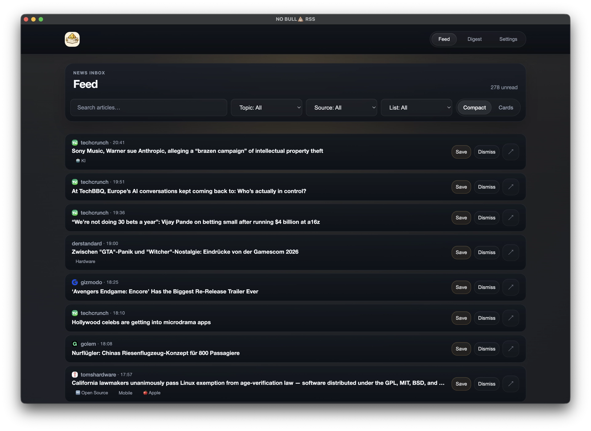
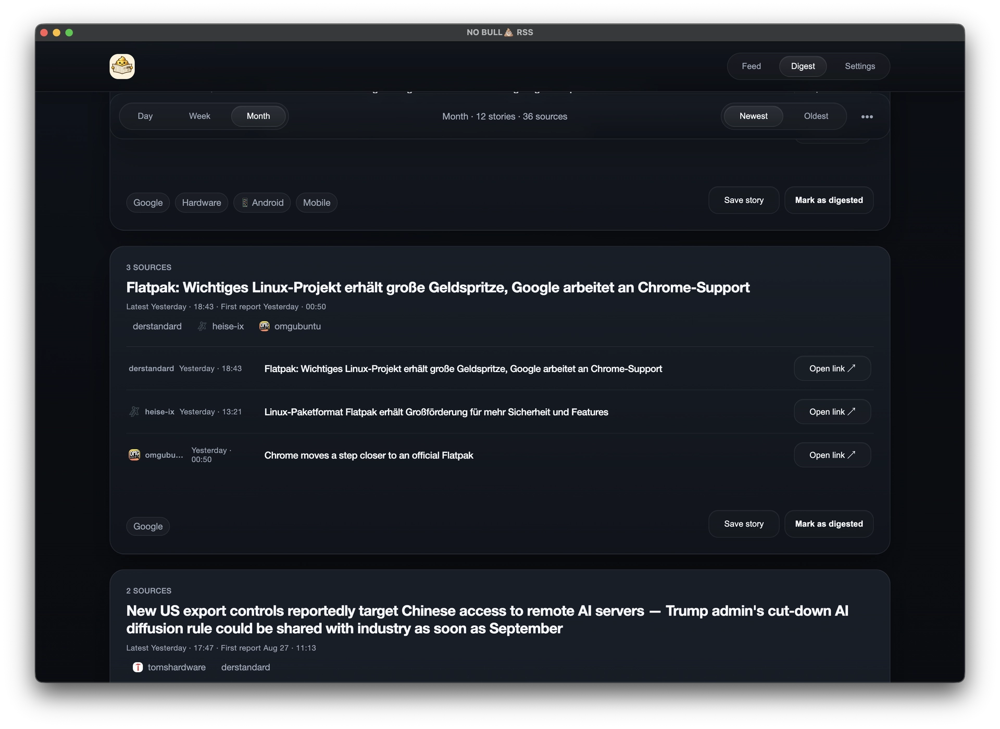
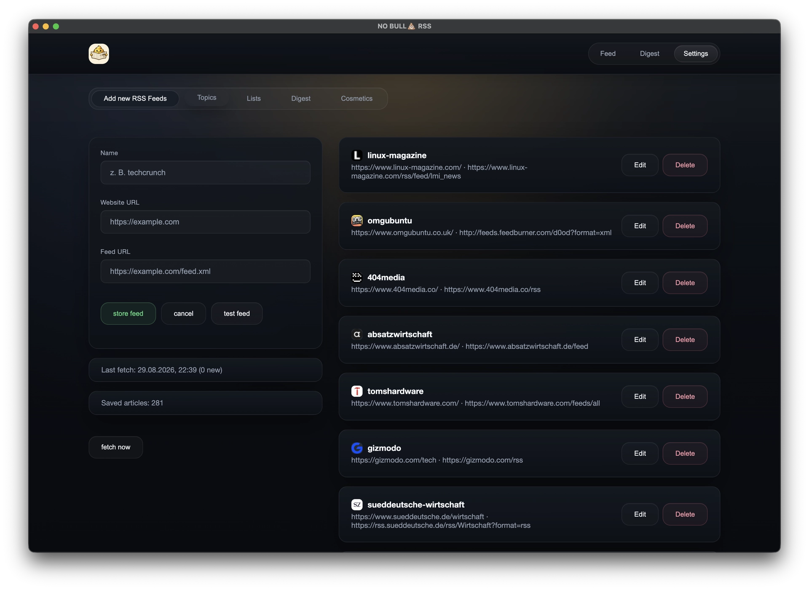
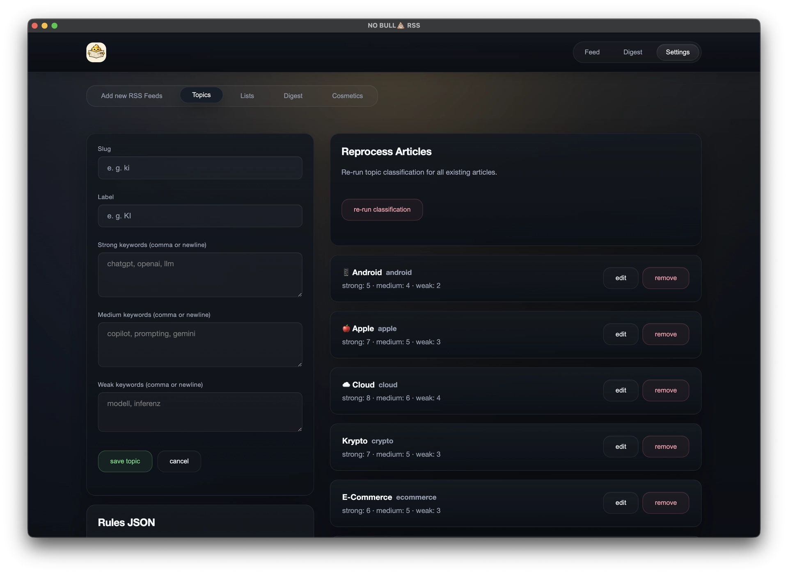

# NO BULLSHIT RSS 💩

I vibe coded some electron slop.



No-Bullshit RSS is a minimal, open-source RSS reader that focuses on reading—not dashboards, upsells, or noise. It’s free, has no payments, and stores your feeds in a self-hosted database so you stay in control of your data.

## Highlights

- Self-hosted DB: your articles are stored in your own database
- Open source and no payment / no subscription / no ads
- Daily Digest: a clustered view that groups related articles for faster scanning
- Local Topics: rule-based topic tagging (no external API) with editable JSON rules
- Improved clustering: fuzzier matching with stronger logic and guardrails
- Instant search: highlight a word, right-click, and search it immediately
- Dark mode
- Storage visibility: settings now show how many articles are in your database

## Digest

Related articles from multiple sources are clustered into daily, weekly, and monthly stories.



## Settings

<details>
<summary>RSS feed management</summary>
<br>



</details>

<details>
<summary>Local topic rules</summary>
<br>



</details>

also check out the [Landing page](https://oliverjessner.at/no-bullshit-rss/#promise).

## run as electron

```bash
npm run electron
```

## CLI

The CLI only reads data already stored by NO BULLSHIT RSS. It does not fetch or configure RSS feeds.

See the [CLI documentation](docs/cli.md) for setup, commands, output formats, and database discovery.

## build for electron (mac, win, linux)

```bash
npm run build:all
```

`build:all` runs the legacy all-platform flow:

```bash
npm run dist:all:workaround
```
